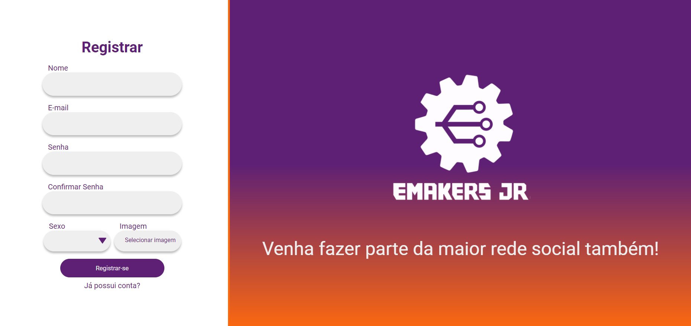
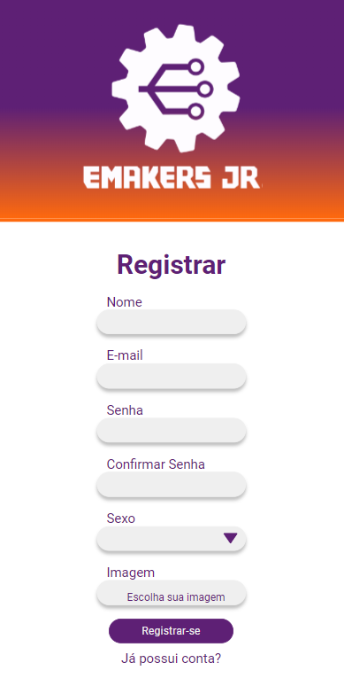
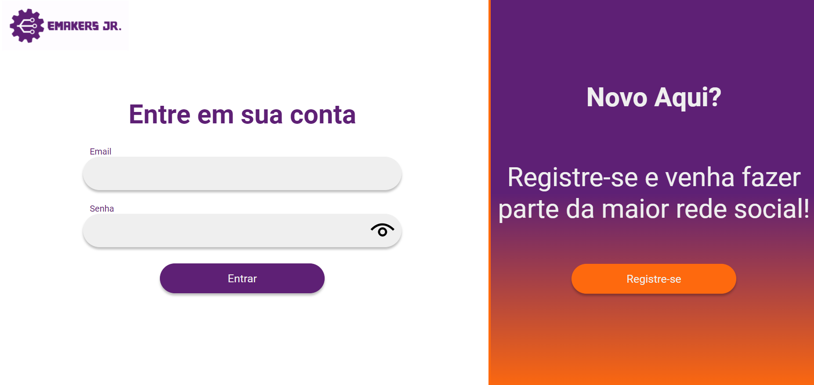
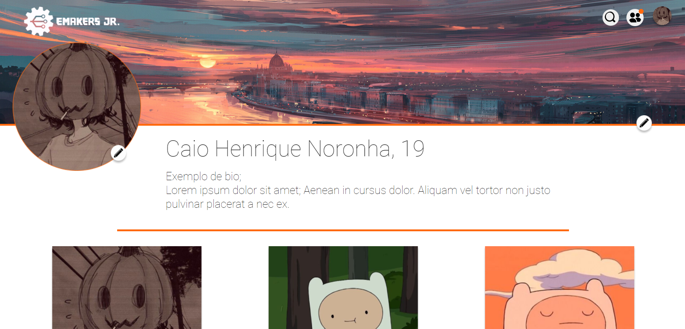
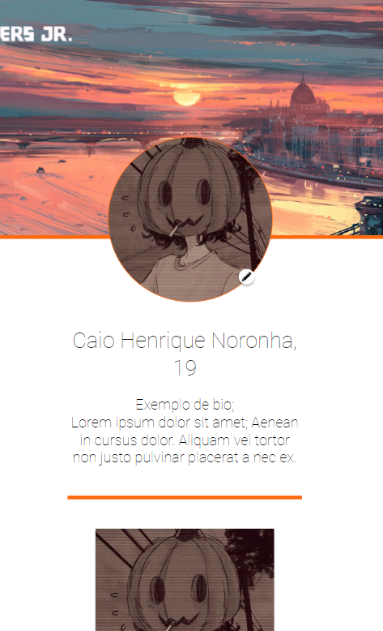

# InstaClone

Este projeto tem como objetivo desenvolver uma aplicação Front-End responsiva, utilizando as tecnologias React, SASS, Express, Prisma, MongoDB e Axios. O foco está na criação de uma interface dinâmica e adaptável, capaz de oferecer uma experiência de usuário consistente em diferentes dispositivos e tamanhos de tela.

# Instruções
Para começar a utilizar o projeto, siga os passos abaixo:

1. Baixe o projeto.
2. No diretório do projeto execute o comando `npm install`
3. Após cumprir os últimos passos, execute `npm run dev`
4. Execute `npm run server` para rodar o servidor
5. Configure o `.env` de acorco com o banco de dados que você irá utilizar e configure `schema.prisma`
6. Execute `npx prisma db push` e `npx prisma studio` 
7. Aproveite!

# Imagens

# React + Vite

This template provides a minimal setup to get React working in Vite with HMR and some ESLint rules.

Currently, two official plugins are available:

- [@vitejs/plugin-react](https://github.com/vitejs/vite-plugin-react/blob/main/packages/plugin-react/README.md) uses [Babel](https://babeljs.io/) for Fast Refresh
- [@vitejs/plugin-react-swc](https://github.com/vitejs/vite-plugin-react-swc) uses [SWC](https://swc.rs/) for Fast Refresh
